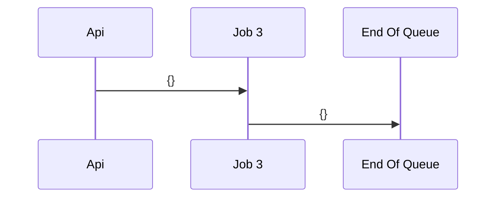

### segment_1

```mermaid
sequenceDiagram
    participant job_1 as Job 1
participant job_2 as Job 2
participant job_2 as Job 2
participant end_of_queue as End Of Queue
    job_1->>job_2: {}
job_2->>end_of_queue: {}

```

### segment_2

```mermaid
sequenceDiagram
    participant api as Api
participant job_3 as Job 3
participant job_3 as Job 3
participant end_of_queue as End Of Queue
    api->>job_3: {}
job_3->>end_of_queue: {}

```