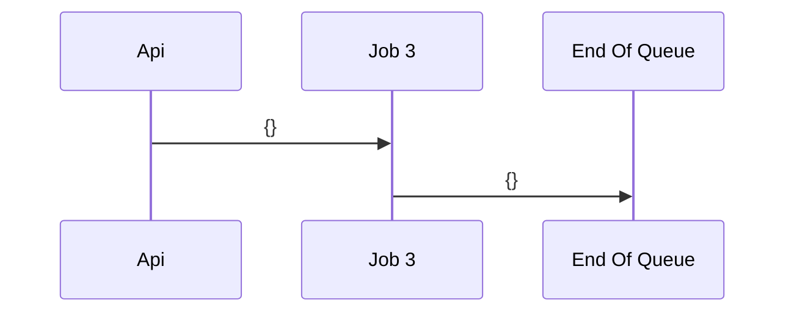
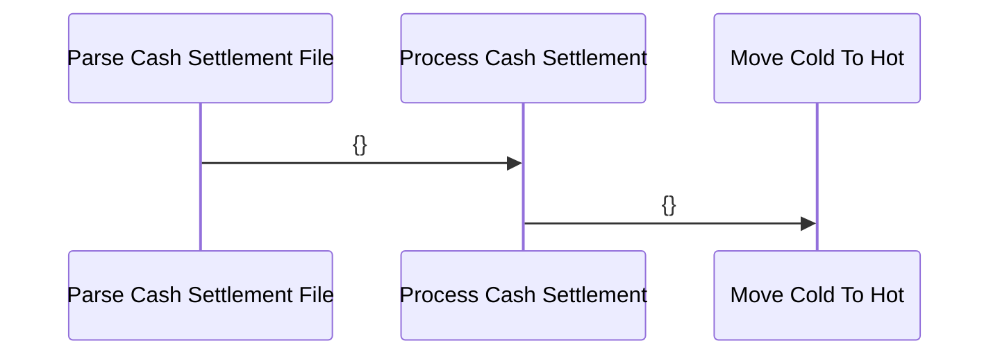
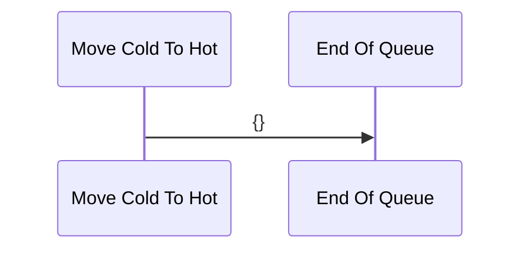

### segment_1


### segment_2


---
## Money Out
### incoming_cash_settlement


### cold_to_hot


### incoming_cash_settlement


### cold_to_hot


### wire_out
```mermaid
sequenceDiagram
    participant coinbase_exchange_deposits as Coinbase Exchange Deposits
participant convert_currency as Convert Currency
participant convert_currency as Convert Currency
participant send_wire as Send Wire
participant send_wire as Send Wire
participant end_of_queue as End Of Queue
    coinbase_exchange_deposits->>convert_currency: {}
convert_currency->>send_wire: {}
send_wire->>end_of_queue: {}
